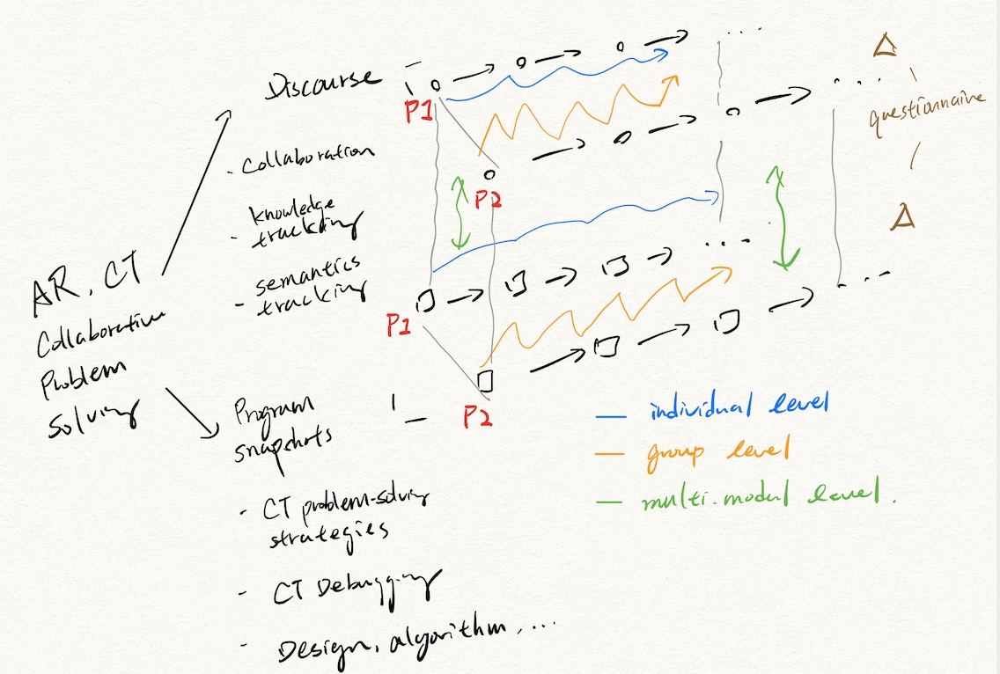

# Ogmented Research Project

This repository is for storing and tracking scripts used in our analysis.

## Data (Not Included in this Repository)

No data is published in this repository now. For more information about this research project, please check our [website](https://sites.google.com/asu.edu/ogmented/home).

## Model

## Notebooks

**Exploratory Data Analysis on Discourse and Code (`og_userstudy_eda1_discourse_code.ipynb`)**

This notebook contains the very first try in EDA on discourse and code. The analyses are focused on summary statistics in the dataset but not the semantics.

**Exploratory Data Analysis on Code Snapshots (`og_userstudy_eda1_code.ipynb`)**

This notebook contains an analysis on the semantics of code snapshots including the passing rate, the correctness (or errorousness), and the code edits.

--------------------

# Output Data Files (Not Included in this Repository)

Data files

- `data.v0.csv`: metadata of user study + audio transcriptions
- `code_snapshot_records.csv`: Aggregated code snapshots in one table
- `task_log_records.csv`: Aggregated task log data in one table
- `trans_records.v0.csv`: `data.v0.csv` + task events

Others

- `state_stimes.csv`: the starting times of important states in the task log
- `event_window.csv`: the times of different events (activities) in the task
- `data.v1.csv`: data V0 + NLP syntatic features (e.g., PoS tags)
- `data.v2.csv`, `data.v2.user.csv`: data V1 + NLP sentiment features

# Processing Scripts

**`preprocess_audio.py` (Py2): Use this script when you need to generate transcriptions and gather the result into one single table.**

An audio and language analyzers based on GCloud libaray. This script is mainly used to do speech-to-text transcription for the audio files.

- Input: raw audio files in the data folder.
- Output: transcription txt files, `audio_info_table.csv`

**`preprocess_trsrpt_meta.py` (Py3): Use this script when you need to extract and append meta data on the raw transcription data.**

This script preprocesses the audio info table (containing speech-to-text transcriptions) by appending some metadata of the user study like task orders, timestamps of audio clips (starting times of recording), and study groups. The output file will be processed manually by the researcher for later analyses.

By default, the human-generated transcriptions are used to extract some statistics of texts and only records on the master device (i.e., `P1`) are kept because our devices actually recorded speaking from both participants.

- Input: `audio_info_table.csv` (generated dynamically by a function in `utils.py`), `proc_data/data.timeline.mapping.csv`
- Output: `data.v0.csv`

**`transcriber.py` (Py3) Use this script when you want to transcribe audio files by yourself. Please review the code before starting since the configuration is not designed in the interface.**

This is a simple GUI application used to help me improve the transcription
from the GCloud service. It has very limited text-editing features.

How to use:

1. Run the program by Python 3.
2. Click on a cell in "r_txt" to edit the content. You may use Cmd+Z to undo
any edit. But there is no way to revert to the original copy now.
3. Click on Play to play associated audio files. Click on Pause to pause
playing. The timeline and seeking are not supported now.
4. Press Ctrl-Return to save the transcript.

- Input: `data.v0.csv`. Note this script ignores the `r_txt` column in the csv file and loads `.wav.r.txt` on the fly. If you plan to update `data.v0.csv`, please re-run the script `preprocess_trsrpt_meta.py`.
- Output: When saving a file, the `.wav.r.txt` copy will be overwritten.

**`preprocess_nlp_tok_sent.py` (Py3): Use when you want to extract NLP features from the transcription**

This script parses the audio info table containing both metadata (generated by the script `preprocess_trsrpt_meta.py`) and transcriptions and extracts several NLP features.

- Input: `data.v0.csv`
- Output: `data.v1.csv`

**`preprocess_sentiments.py` (Py2): You probably don't need this script now.**

This script is used to parse transcriptions to extract sentiments in the content. The result is mixed. This script may use the GCloud service.

- Input: `data.v1.csv`
- Output: `data.v2.csv`

**`preprocess_spectrum.py` (Py3): You probably don't need this script now.**

This script is used to extract spectral features from the audio clips.

- Input: `data.v2.csv` or `data.v1.csv` (only for audio_path lookup)
- Output: An npy data for each spectral feature (saved along with the input audio clips)
